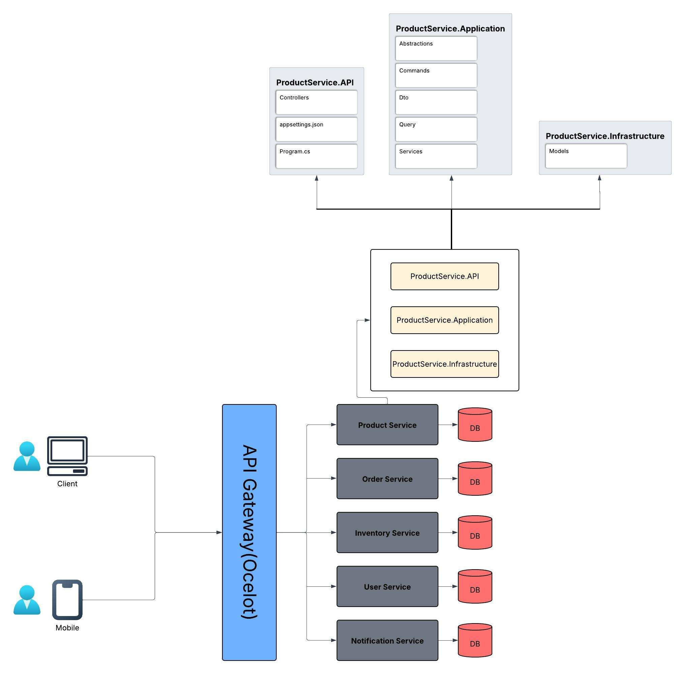



# High-Level Architecture

**Week 2**: Provide a high-level architecture for the application (service components, communication patterns, databases, etc.)

## Tech Stack

- .NET Core 8  
- SQL Server Database  
- Docker  
- Ocelot (API Gateway)  
- RabbitMQ (Message Bus/Queue)  

## Microservices

The project is divided into these microservices, each with its own database:

- **ProductService**  
- **OrderService**  
- **UserService**  
- **InventoryService**  
- **NotificationService**  

## Containerization

Each microservice runs in its own Docker container, which ensures:

- No dependency conflicts  
- Independent development, deployment and scaling  

## API Gateway (Ocelot)

- Routes external HTTP requests to the appropriate service  
- Hides internal service structure  
- Supports routing, logging, rate limiting and authentication  

_Example:_ instead of `/users/api/users`, `/products/api/products`, or `/orders/api/orders`, clients call `/api/users`, `/api/products`, `/api/orders`, etc.

## RabbitMQ (Message Bus/Queue)

- Acts as a message broker for asynchronous communication between services  
- Allows services to publish and consume messages without direct coupling  

**Benefits:**  
- Loose coupling between services  

## CI/CD Pipeline (`build.yml`)

### Continuous Integration

- Builds and tests the code on every push  
- Notifies the team if the build or tests fail  

### Continuous Deployment

- Builds Docker images after successful tests  
- Deploys containers automatically upon success  

---

# Week 3: Database Design and API Implementation

- Created individual **SQL Server databases** for each microservice:
  - `dev-product`, `dev-order`, `dev-user`, `dev-inventory`, `dev-notification`
- Designed and created **initial schemas** for each service (e.g., `Products`, `Categories`, `Orders`, etc.)
- Used **EF Core scaffolding** to reverse-engineer models into each service’s `Infrastructure/Models` folder
- Configured and registered **DbContexts** in each `.API` project using `Program.cs` and `appsettings.json`
- Added **project references**:
  - `.API → .Application → .Infrastructure`
- Built full **CRUD operations** for `ProductService`:
  - `AddProductCommand` and `EditProductCommand` for input
  - `ProductDto` and `GetProductByIdDto` for output
  - `ProductServiceImpl` in Application layer for business logic
  - `ProductsController` in API for HTTP endpoints


# Week 4: Caching & Performance Optimization

**Goal**  
Improve response times and reduce database load for frequently accessed endpoints.

**Implementation Details**  
1. **Memory caching** in `GetByIdAsync` using `IMemoryCache`  
 - Key: `product:{id}`  
 - Duration: 10 minutes  
2. **Cache invalidation**  
 - On delete: remove `product:{id}`  
 - On update: remove `product:{id}`  
3. **Query optimization**  
 - Added index on `CategoryId` for faster filtering  

**Performance Impact**  
- `GetByIdAsync` responses now return in ~1–2 ms from cache  
- No EF Core query if data is cached  
- Significantly fewer database hits under load  

**Tools Used**  
- `IMemoryCache` (`Microsoft.Extensions.Caching.Memory`)  
- .NET scoped DI  
- SQL Server index on `CategoryId`  

---

# Event-Driven Architecture & Message Broker Choice

**Why did I choose RabbitMQ**  
- **Simplicity & flexibility**: supports fan-out, direct, topic exchanges  
- **Reliable delivery**: retains messages until acknowledged  
- **High throughput**: lightweight and fast for real-time events  
- **.NET support**: mature `RabbitMQ.Client` library  

**Design Overview**  
- **Publisher (ProductService)**:  
- Deletes product → publishes `Product deleted: {id}` to `product-deleted` queue  
- **Consumer (InventoryService)**:  
- Background worker listens on `product-deleted`  
- Logs and handles cleanup  

**Key Benefits**  
- Loose coupling via events  
- Resilience: RabbitMQ buffers messages if a consumer is down  
- Scalability: add new consumers without touching the publisher  
- Observability through the RabbitMQ UI and logs  

---

# Demonstrating Failure and Recovery

**Scenario:** InventoryService is down when an event is published

1. **InventoryService offline**  
 - No listener on `product-deleted`  
2. **Publish event**  
 - ProductService publishes `Product deleted: {id}`  
 - Message stays in queue (Ready = 1)  
3. **InventoryService restart**  
 - Reconnects to RabbitMQ  
 - Consumes pending message  
 - Logs:  
   ```
   [InventoryService] Received: Product deleted: {id} at 2025-05-18T23:12:50Z
   ```

**Outcomes**  
- Independent availability: services fail and recover safely  
- Durable messaging: no data loss  
- Automatic recovery: pending messages processed on restart  
- End-to-end resilience in distributed architecture  


# Week 5: Scalability tests

This week's document captures the high-level results of my **Load**, **Stress** and **Scalability** testing for the `ProductService.API` microservice.

---

## 1. Load Test

- **Scenario:** 50 concurrent users, each sending 10 requests (500 total), ramp-up in 1 ms  
- **Key Metrics:**  
  - **Avg. Response Time:** ~100 ms  
  - **Median (50th):** 105 ms  
  - **90th %ile:** 162 ms  
  - **95th %ile:** 178 ms  
  - **99th %ile:** 244 ms  
  - **Min / Max:** 14 ms / 284 ms  
  - **Throughput:** 250.6 req/sec  
  - **Error Rate:** 0.00%  

**Interpretation:** the service handled sustained load with consistent latencies and no errors.

---

## 2. Stress Test

| Users | Avg RT | Median | 90% Line | 95% Line | 99% Line | Min  | Max  | Throughput | Errors |
|------:|-------:|-------:|---------:|---------:|---------:|-----:|-----:|-----------:|-------:|
|   100 |   10 ms |    9 ms |    11 ms |    13 ms |    56 ms |  7 ms | 95 ms |     10.1/sec |   0%  |
|   300 |    8 ms |    9 ms |    10 ms |    10 ms |    11 ms |  6 ms | 21 ms |     30.4/sec |   0%  |
|  1000 |    8 ms |    7 ms |     8 ms |     9 ms |    58 ms |  5 ms | 91 ms |    100.1/sec |   0%  |

**Interpretation:** no failures at up to 1000 users, with throughput scaling linearly and 99th-percentile still under 60 ms.

---

## 3. Scalability Test

| Replicas | Users | Avg RT | Throughput  | Errors |
|---------:|------:|-------:|------------:|-------:|
| **3**    |   100 | 361 ms |   3.4 req/sec |   0%  |
| **3**    |   300 | 134 ms |   6.2 req/sec |   0%  |
| **3**    |  1000 | 133 ms |   7.2 req/sec |   0%  |
| **5**    |  1000 |   4 ms |  11.7 req/sec |   0%  |

**Interpretation:** each added replica increases capacity by ~2 req/sec; at 5 replicas latency collapses to single-digit ms.

---
# Unit Testing Report – ProductService and ProductController

## Overview

This report documents the unit tests implemented for the `ProductService` and `ProductController` components of the application. Tests are written using **xUnit** as the test framework and **FluentAssertions** for expressive assertions. 

Mocking was done using **Moq**, and **Entity Framework Core InMemoryDatabase** was used for simulating the data layer.

---

## ProductService Unit Tests

### Setup

- A new in-memory database is created per test using `Guid.NewGuid()` to avoid data collision.
- `MemoryCache` is used to simulate caching behavior.
- A custom `FakeEventBusPublisher` is injected to bypass real RabbitMQ publishing during unit tests.

### Tests

- **AddProductAsync_ReturnsProductId**  
  Verifies that adding a product returns a valid ID.

- **GetAllProductsAsync_ReturnsListWithCategoryNames**  
  Ensures the product is returned with the correct category name.

- **GetByIdAsync_Cached_ReturnsFromCache**  
  Tests retrieval of a product directly from cache.

- **GetByIdAsync_NotCached_ReturnsAndCaches**  
  Verifies a product is fetched from the database if not cached, and then cached.

- **UpdateAsync_Exists_ReturnsTrueAndUpdates**  
  Confirms successful update of an existing product.

- **UpdateAsync_NotFound_ReturnsFalse**  
  Returns false when trying to update a non-existent product.

- **DeleteAsync_Exists_ReturnsTrueAndDeletes**  
  Confirms a product is successfully deleted.

- **DeleteAsync_NotFound_ReturnsFalse**  
  Returns false when attempting to delete a non-existent product.

---

## ProductController Unit Tests

### Setup

- `IProductService` is mocked using Moq.
- `ProductController` is tested by injecting the mock service.

### Tests

- **GetAll_ReturnsOkWithExpectedData**  
  Verifies the `GetAll` action returns a 200 OK with the expected data.

- **AddProduct_ReturnsOkWithProductId**  
  Ensures the added product returns an ID wrapped in a 200 OK result.

- **GetById_ProductExists_ReturnsOk**  
  Returns the expected product when found.

- **GetById_ProductDoesNotExist_ReturnsNotFound**  
  Returns 404 when the product is not found.

- **Update_ProductExists_ReturnsNoContent**  
  Verifies that updating an existing product returns 204 No Content.

- **Update_ProductNotFound_ReturnsNotFound**  
  Returns 404 Not Found when updating a non-existent product.

- **Delete_ProductExists_ReturnsNoContent**  
  Confirms deletion of an existing product returns 204 No Content.

- **Delete_ProductNotFound_ReturnsNotFound**  
  Returns 404 when attempting to delete a non-existent product.

---

## Conclusion

- All tests passed successfully.
- Both positive and negative scenarios are covered.
- In-memory databases and mocks ensure isolation and determinism.
- FluentAssertions enhances readability and maintainability of tests.


